AstroStats Final Project
================
Mira Flynn
4/6/2022

- <a href="#setup-and-data-cleaning"
  id="toc-setup-and-data-cleaning">Setup and Data Cleaning</a>
- <a href="#initial-looks-at-several-variables"
  id="toc-initial-looks-at-several-variables">Initial looks at several
  variables</a>
- <a href="#shapefile-work" id="toc-shapefile-work">Shapefile Work</a>
- <a href="#processed-density-graphs"
  id="toc-processed-density-graphs">Processed Density Graphs</a>
- <a href="#more-stuff-im-leaving-in"
  id="toc-more-stuff-im-leaving-in">More stuff I’m leaving in</a>

## Setup and Data Cleaning

``` r
# Dependencies
library(tidyverse)
```

    ## ── Attaching packages ─────────────────────────────────────── tidyverse 1.3.2 ──
    ## ✔ ggplot2 3.4.0      ✔ purrr   0.3.5 
    ## ✔ tibble  3.1.8      ✔ dplyr   1.0.10
    ## ✔ tidyr   1.2.1      ✔ stringr 1.4.1 
    ## ✔ readr   2.1.3      ✔ forcats 0.5.2 
    ## ── Conflicts ────────────────────────────────────────── tidyverse_conflicts() ──
    ## ✖ dplyr::filter() masks stats::filter()
    ## ✖ dplyr::lag()    masks stats::lag()

``` r
library(magrittr)
```

    ## 
    ## Attaching package: 'magrittr'
    ## 
    ## The following object is masked from 'package:purrr':
    ## 
    ##     set_names
    ## 
    ## The following object is masked from 'package:tidyr':
    ## 
    ##     extract

``` r
library(sf)
```

    ## Linking to GEOS 3.11.0, GDAL 3.5.3, PROJ 9.1.0; sf_use_s2() is TRUE

``` r
# Create the final PDF with code snippets shown
knitr::opts_chunk$set(echo = TRUE)

sf::sf_use_s2(FALSE) # this fixes the geometry of the shapefile for some reason
```

    ## Spherical geometry (s2) switched off

``` r
# This is a premade graph theme I originally got from ZDR and modified for myself
theme_common <- function() {
  theme_minimal() %+replace%
  theme(
    axis.text.x = element_text(size = 12),
    axis.text.y = element_text(size = 12),
    axis.title.x = element_text(margin = margin(4, 4, 4, 4), size = 16),
    axis.title.y = element_text(margin = margin(4, 4, 4, 4), size = 16, angle = 90),
    legend.title = element_text(size = 16),
    legend.text = element_text(size = 12),
    strip.text.x = element_text(size = 12),
    strip.text.y = element_text(size = 12),
    panel.grid.major = element_line(color = "grey90"),
    panel.grid.minor = element_line(color = "grey90"),
    aspect.ratio = 10/16,
    plot.margin = unit(c(t = +0.5, b = +0, r = +0, l = +0), "cm"),
    plot.title = element_text(size = 18),
    # plot.title.position = "plot",
    plot.subtitle = element_text(size = 16),
    plot.caption = element_text(size = 12)
  )
}

## Helper function to compute uncertainty bounds
# More taking code from ZDR!
add_uncertainties <- function(data, model, prefix = "pred", ...) {
  df_fit <-
    stats::predict(model, data, ...) %>%
    as_tibble() %>%
    rename_with(~ str_c(prefix, "_", .))

  bind_cols(data, df_fit)
}

rad2deg <- function(rad) {(rad * 180) / (pi)}
deg2rad <- function(deg) {(deg * pi) / (180)}
# https://stackoverflow.com/questions/32370485/convert-radians-to-degree-degree-to-radians

# r = Radius of Moon in KM
r <- 1737.4

# How much to round the latitudes. Round to spacing of 5
round_digits = 5
```

This is all the data cleaning that I did on the Robbins dataset. It is
mainly working with the shapefile to categorize each point by biome.

``` r
map = read_sf("data/LROC_GLOBAL_MARE_180.SHP") %>% # Load the maria shapefile
  st_make_valid() # I don't know what this does exactly but it fixes the shapefile
st_crs(map$geometry) <- 4326 # Again, I don't understand
```

    ## Warning: st_crs<- : replacing crs does not reproject data; use st_transform for
    ## that

``` r
df_craters <- read.csv("data/AstroStats_Robbins_Moon.csv") %>% # Load the dataset
  mutate( # Change longitude from 0 to 360  -> -180 to 180
      LON_ELLI_IMG = ifelse(LON_ELLI_IMG > 180, LON_ELLI_IMG-360, LON_ELLI_IMG)
  ) %>%
  filter(!is.na(LAT_ELLI_IMG)) %>% # Get rid of the 8 craters with NA ellipses
  st_as_sf( # Convert the craters dataset to a shapefile object
    coords = c("LON_ELLI_IMG", "LAT_ELLI_IMG"), 
    crs = st_crs(map),
    remove = FALSE
  ) %>% 
  mutate(
    intersection = geometry %>% st_intersects(map, sparse = TRUE),
    # Intersection column is where each point intersects the map, if any
    MARIA = (intersection %>% as.character()) != "integer(0)"
    # This is a bit chaotic. The intersection column is a funky object type, so
    # to compare it, I cast it to a character type. If the intersection is 0,
    # then the point is not in one of the maria regions. 
  ) %>%
  as.data.frame() %>% # Need to cast back to dataframe to get rid of geometry
  select( # Get rid of the intersection and geometry columns for clarity.
    -c(intersection, geometry)
  )
```

    ## although coordinates are longitude/latitude, st_intersects assumes that they
    ## are planar
    ## although coordinates are longitude/latitude, st_intersects assumes that they
    ## are planar

``` r
df_craters %>% write.csv(
    "data/AstroStats_Robbins_Moon_Maria.csv", 
    row.names = FALSE
  ) # Write modified data to CSV
```

``` r
df_craters %>% head()
```

    ##   X   CRATER_ID LAT_CIRC_IMG LON_CIRC_IMG LAT_ELLI_IMG LON_ELLI_IMG
    ## 1 0 00-1-000000    -19.83040     264.7570    -19.89050     -95.3350
    ## 2 1 00-1-000001     44.77630     328.6020     44.40830     -30.9540
    ## 3 2 00-1-000002     57.08660      82.0995     56.90000      81.6464
    ## 4 3 00-1-000003      1.96124     230.6220      1.95072    -129.4120
    ## 5 4 00-1-000004    -49.14960     266.3470    -49.18330     -93.6470
    ## 6 5 00-1-000005    -35.60240     208.4860    -35.62210    -151.5100
    ##   DIAM_CIRC_IMG DIAM_CIRC_SD_IMG DIAM_ELLI_MAJOR_IMG DIAM_ELLI_MINOR_IMG
    ## 1       940.960         21.31790             975.874             905.968
    ## 2       249.840          5.99621             289.440             245.786
    ## 3       599.778         21.57900             632.571             561.435
    ## 4       558.762         14.18190             568.529             546.378
    ## 5       654.332         17.50970             665.240             636.578
    ## 6       505.312         12.84720             505.313             500.675
    ##   DIAM_ELLI_ECCEN_IMG DIAM_ELLI_ELLIP_IMG DIAM_ELLI_ANGLE_IMG LAT_ELLI_SD_IMG
    ## 1            0.371666             1.07716             35.9919      0.00788792
    ## 2            0.528111             1.17761            127.0030      0.01117760
    ## 3            0.460721             1.12670            149.1620      0.00846450
    ## 4            0.276416             1.04054            133.6910      0.00707867
    ## 5            0.290365             1.04502             87.6468      0.00882679
    ## 6            0.135169             1.00926             16.1189      0.00929176
    ##   LON_ELLI_SD_IMG DIAM_ELLI_MAJOR_SD_IMG DIAM_ELLI_MINOR_SD_IMG
    ## 1      0.00842373               0.636750               0.560417
    ## 2      0.01510130               1.052780               0.209035
    ## 3      0.01951530               0.776149               0.747352
    ## 4      0.00783918               0.526945               0.532872
    ## 5      0.01773270               0.568958               0.758631
    ## 6      0.01056500               0.580106               0.827589
    ##   DIAM_ELLI_ANGLE_SD_IMG DIAM_ELLI_ECCEN_SD_IMG DIAM_ELLI_ELLIP_SD_IMG  ARC_IMG
    ## 1               0.373749             0.00208495            0.000968482 0.568712
    ## 2               0.357296             0.00510045            0.004398870 0.627328
    ## 3               0.374057             0.00309534            0.002039740 0.492373
    ## 4               1.262710             0.00449557            0.001400000 0.595221
    ## 5               1.383530             0.00462588            0.001532910 0.545924
    ## 6               6.227410             0.01461670            0.002031140 0.557812
    ##   PTS_RIM_IMG MARIA
    ## 1        8088 FALSE
    ## 2        2785  TRUE
    ## 3        5199  TRUE
    ## 4        4341 FALSE
    ## 5        5933 FALSE
    ## 6        4433  TRUE

``` r
df_craters %>% summary()
```

    ##        X            CRATER_ID          LAT_CIRC_IMG      LON_CIRC_IMG     
    ##  Min.   :      0   Length:83053       Min.   :-89.663   Min.   :  0.0063  
    ##  1st Qu.: 277665   Class :character   1st Qu.:-35.586   1st Qu.:106.5030  
    ##  Median : 623174   Mode  :character   Median : -1.367   Median :171.4800  
    ##  Mean   : 623841                      Mean   : -1.063   Mean   :170.1799  
    ##  3rd Qu.: 975103                      3rd Qu.: 33.482   3rd Qu.:231.1750  
    ##  Max.   :1296795                      Max.   : 89.648   Max.   :359.9970  
    ##   LAT_ELLI_IMG      LON_ELLI_IMG      DIAM_CIRC_IMG      DIAM_CIRC_SD_IMG  
    ##  Min.   :-89.662   Min.   :-179.997   Min.   :   5.000   Min.   : 0.01371  
    ##  1st Qu.:-35.592   1st Qu.:-119.815   1st Qu.:   5.876   1st Qu.: 0.11243  
    ##  Median : -1.361   Median :  18.138   Median :   7.406   Median : 0.17643  
    ##  Mean   : -1.063   Mean   :   2.744   Mean   :  11.235   Mean   : 0.25943  
    ##  3rd Qu.: 33.486   3rd Qu.: 116.626   3rd Qu.:  10.936   3rd Qu.: 0.28774  
    ##  Max.   : 89.647   Max.   : 179.998   Max.   :2491.870   Max.   :63.39790  
    ##  DIAM_ELLI_MAJOR_IMG DIAM_ELLI_MINOR_IMG DIAM_ELLI_ECCEN_IMG
    ##  Min.   :   4.719    Min.   :   3.048    Min.   :0.03179    
    ##  1st Qu.:   6.289    1st Qu.:   5.476    1st Qu.:0.34803    
    ##  Median :   7.961    Median :   6.899    Median :0.44909    
    ##  Mean   :  11.946    Mean   :  10.526    Mean   :0.45230    
    ##  3rd Qu.:  11.753    3rd Qu.:  10.221    3rd Qu.:0.55342    
    ##  Max.   :2612.570    Max.   :2373.250    Max.   :0.96762    
    ##  DIAM_ELLI_ELLIP_IMG DIAM_ELLI_ANGLE_IMG LAT_ELLI_SD_IMG    
    ##  Min.   :1.001       Min.   :  0.00655   Min.   :0.0000984  
    ##  1st Qu.:1.067       1st Qu.: 51.81780   1st Qu.:0.0005338  
    ##  Median :1.119       Median : 89.80180   Median :0.0008523  
    ##  Mean   :1.153       Mean   : 90.02123   Mean   :0.0014195  
    ##  3rd Qu.:1.201       3rd Qu.:128.44800   3rd Qu.:0.0014196  
    ##  Max.   :3.962       Max.   :179.99500   Max.   :2.4179200  
    ##  LON_ELLI_SD_IMG     DIAM_ELLI_MAJOR_SD_IMG DIAM_ELLI_MINOR_SD_IMG
    ##  Min.   :0.0001057   Min.   :  0.00692      Min.   : 0.007286     
    ##  1st Qu.:0.0006575   1st Qu.:  0.03600      1st Qu.: 0.034753     
    ##  Median :0.0010969   Median :  0.05850      Median : 0.054011     
    ##  Mean   :0.0021075   Mean   :  0.10733      Mean   : 0.076606     
    ##  3rd Qu.:0.0019524   3rd Qu.:  0.10132      3rd Qu.: 0.086352     
    ##  Max.   :0.9103970   Max.   :151.99800      Max.   :22.613300     
    ##  DIAM_ELLI_ANGLE_SD_IMG DIAM_ELLI_ECCEN_SD_IMG DIAM_ELLI_ELLIP_SD_IMG
    ##  Min.   :  0.0813       Min.   :0.0007235      Min.   :0.000923      
    ##  1st Qu.:  1.7254       1st Qu.:0.0122149      1st Qu.:0.007434      
    ##  Median :  2.8208       Median :0.0187031      Median :0.012080      
    ##  Mean   :  4.3972       Mean   :0.0240404      Mean   :0.017126      
    ##  3rd Qu.:  4.8193       3rd Qu.:0.0292197      3rd Qu.:0.019771      
    ##  Max.   :412.8600       Max.   :0.7200230      Max.   :3.909610      
    ##     ARC_IMG         PTS_RIM_IMG        MARIA        
    ##  Min.   :0.02757   Min.   :   9.00   Mode :logical  
    ##  1st Qu.:0.64482   1st Qu.:  31.00   FALSE:80999    
    ##  Median :0.75763   Median :  43.00   TRUE :2054     
    ##  Mean   :0.73080   Mean   :  72.92                  
    ##  3rd Qu.:0.85342   3rd Qu.:  72.00                  
    ##  Max.   :1.00000   Max.   :8088.00

## Initial looks at several variables

Note: These plots were intended for data exploration, and therefore are
not presentation quality.

``` r
df_craters %>%
  ggplot(aes(x = LAT_ELLI_IMG, y = DIAM_ELLI_ANGLE_IMG)) +
  geom_point(alpha = 0.1) +
  geom_smooth()
```

    ## `geom_smooth()` using method = 'gam' and formula = 'y ~ s(x, bs = "cs")'

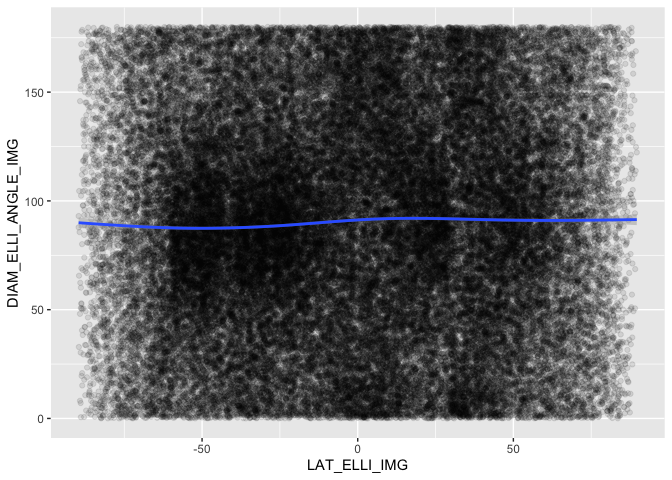<!-- -->

This graph explores the angle for the most eccentric craters. Craters
with low eccentricity are nearly circular, so the direction they point
may be more random.

``` r
df_craters %>%
  mutate(
    LAT_ELLI_IMG = abs(LAT_ELLI_IMG),
    DIAM_ELLI_ANGLE_IMG = DIAM_ELLI_ANGLE_IMG %% 180
  ) %>%
  filter(DIAM_ELLI_ECCEN_IMG > 0.8) %>%
  filter(LAT_ELLI_IMG < 60) %>%
  ggplot(aes(x = LAT_ELLI_IMG, y = DIAM_ELLI_ANGLE_IMG)) +
  geom_point(alpha = 0.1) +
  geom_smooth()
```

    ## `geom_smooth()` using method = 'loess' and formula = 'y ~ x'

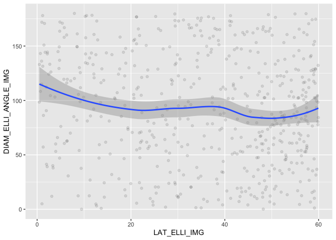<!-- -->

This graph seems to show some eccentricity variation across different
latitudes, but there are noticeable lines where the Robbins paper
switched projections. Therefore, I decided not to explore this pattern
further.

``` r
df_craters %>%
  ggplot(aes(x = LAT_ELLI_IMG, y = DIAM_ELLI_ECCEN_IMG)) +
  geom_point(alpha = 0.1) +
  geom_smooth()
```

    ## `geom_smooth()` using method = 'gam' and formula = 'y ~ s(x, bs = "cs")'

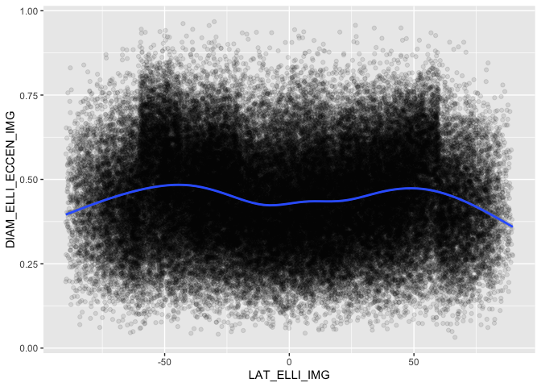<!-- -->

``` r
df_craters %>%
  ggplot(aes(x = LAT_ELLI_IMG, y = DIAM_ELLI_MAJOR_IMG)) +
  geom_point(alpha = 0.1) +
  geom_smooth() +
  scale_y_log10()
```

    ## `geom_smooth()` using method = 'gam' and formula = 'y ~ s(x, bs = "cs")'

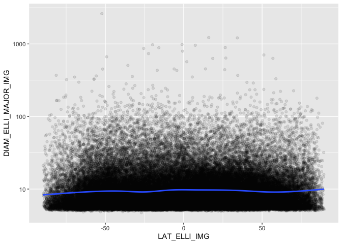<!-- -->

``` r
df_craters %>%
  ggplot(aes(x = LAT_ELLI_IMG, y = DIAM_ELLI_MINOR_IMG)) +
  geom_point(alpha = 0.1) +
  geom_smooth() +
  scale_y_log10()
```

    ## `geom_smooth()` using method = 'gam' and formula = 'y ~ s(x, bs = "cs")'

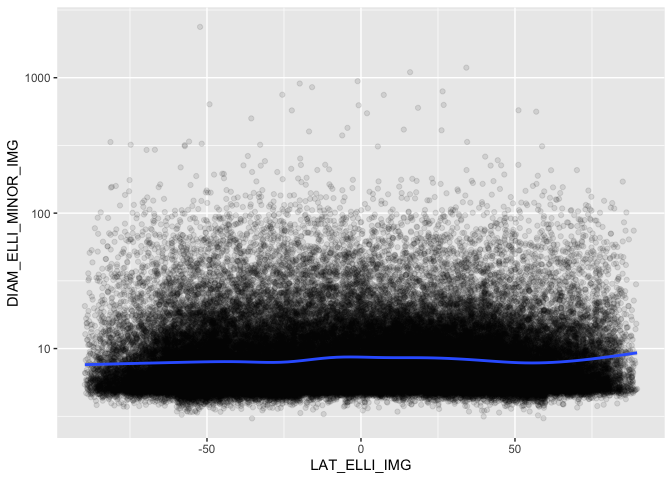<!-- -->

Plotting craters by latitude and longitude creates essentially a map of
the moon.

``` r
df_craters %>%
  ggplot(aes(x = LON_ELLI_IMG, y = LAT_ELLI_IMG)) +
  geom_point(alpha = 0.1) +
  coord_fixed()
```

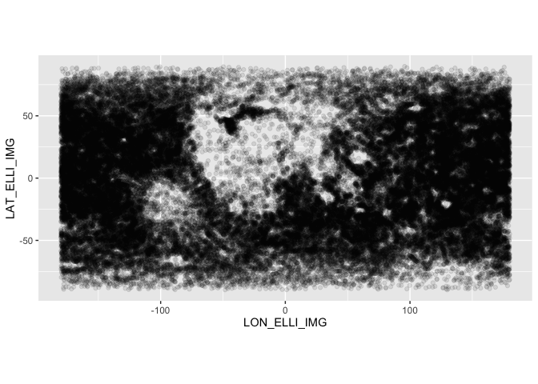<!-- -->

``` r
# WOAH THIS IS SO COOL LOOK AT THIS
# https://www.physics.unlv.edu/~jeffery/astro/moon/map/moon_map_mercator.jpg
```

This histogram was my first look at density, and is affected by the
circumference of the moon being different at each latitude

``` r
df_craters %>%
  ggplot(aes(LAT_ELLI_IMG)) +
  geom_histogram(bins = 36) +
  scale_x_continuous(breaks = c(-90,-60,-30,0,30,60,90))
```

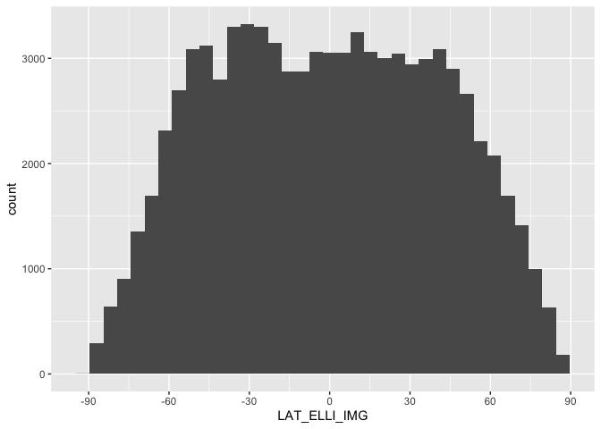<!-- -->

``` r
# NOTE: This isn't accounting for diameter changes over latitudes
```

## Shapefile Work

This is the equally spaced points data, which I used to calculate area
of each biome at each latitude

``` r
# Create empty lists of lats and lons
lats = c()
lons = c()

# Add every combo of lats and lons, spaced at 2 degrees, to the list
for (lat in seq(-90,90,1)){
  for (lon in seq(-180,180,1)){
    lats = c(lats, lat)
    lons = c(lons, lon)
  }
}


pnts <- data.frame(lat = lats, lon = lons) %>% # Make a dataframe of the evenly
  # spaced points
  st_as_sf( # Then do the same things as we did with the craters dataset.
    coords = c("lon", "lat"), 
    crs = st_crs(map),
    remove = FALSE
  ) %>% 
  mutate(
    intersection = geometry %>% st_intersects(map) %>% as.integer(),
    # For some reason, this dataframe works a bit differently. I don't
    # understand why, and I'm not gonna spend a bunch of time figuring out why
    maria = !is.na(intersection)
  )
```

    ## although coordinates are longitude/latitude, st_intersects assumes that they
    ## are planar
    ## although coordinates are longitude/latitude, st_intersects assumes that they
    ## are planar

``` r
pnts %>% summary()
```

    ##       lat           lon                geometry      intersection  
    ##  Min.   :-90   Min.   :-180   POINT        :65341   Min.   :  1.0  
    ##  1st Qu.:-45   1st Qu.: -90   epsg:4326    :    0   1st Qu.:266.0  
    ##  Median :  0   Median :   0   +proj=long...:    0   Median :341.0  
    ##  Mean   :  0   Mean   :   0                         Mean   :314.7  
    ##  3rd Qu.: 45   3rd Qu.:  90                         3rd Qu.:346.0  
    ##  Max.   : 90   Max.   : 180                         Max.   :609.0  
    ##                                                     NA's   :57533  
    ##    maria        
    ##  Mode :logical  
    ##  FALSE:57533    
    ##  TRUE :7808     
    ##                 
    ##                 
    ##                 
    ## 

``` r
pnts %>%
  ggplot() +
  geom_point(aes(x = lon, y = lat, color = maria), size = 0.2) +
  coord_fixed()
```

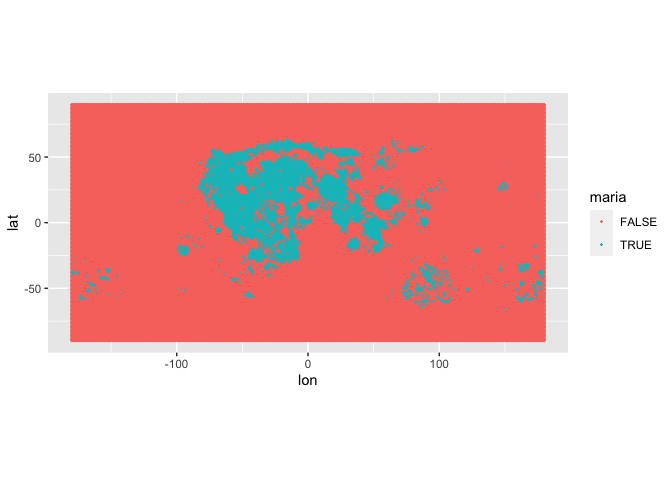<!-- -->

``` r
pnts %>% write.csv(
    "data/AstroStats_Degree_Spaced_Maria_Or_Highlands.csv", 
    row.names = FALSE
  ) # Write modified data to CSV
```

This calculates the portion of the area at each latitude that is in the
maria.

``` r
maria_portions <- pnts %>%
  mutate(
    LAT_ROUND = round(lat/round_digits)*round_digits # Round to nearest latitude bin
  ) %>%
  filter(
    abs(LAT_ROUND) < 90 # 0 circumference at 90 degrees
  ) %>%
  group_by(LAT_ROUND) %>%
  summarize(
    PORTION_MARIA = mean(maria) # Get the mean of the true/false maria column
  ) %>%
  as.data.frame() %>%
  select(c(-geometry))
```

    ## although coordinates are longitude/latitude, st_union assumes that they are
    ## planar

``` r
maria_portions %>% head()
```

    ##   LAT_ROUND PORTION_MARIA
    ## 1       -85   0.000000000
    ## 2       -80   0.000000000
    ## 3       -75   0.000000000
    ## 4       -70   0.000000000
    ## 5       -65   0.003878116
    ## 6       -60   0.038227147

``` r
df_craters_hist <- df_craters %>%
  mutate(
    LAT_ROUND = round(LAT_ELLI_IMG/round_digits)*round_digits
  ) %>%
  filter(
    abs(LAT_ROUND) < 90 # Get rid of 90s because they round to 0 area
  ) %>%
  group_by(LAT_ROUND, MARIA) %>%
  summarize(
    COUNT_LAT_ROUND = n() # Count number of craters in each biome and latitude
  ) %>%
  mutate(
    CIRCUMFERENCE_LAT = 2*pi*r*cos(deg2rad(LAT_ROUND)),
    NORM_LAT_ROUND = COUNT_LAT_ROUND/CIRCUMFERENCE_LAT # Normalize by area
  ) %>%
  left_join(maria_portions, by = "LAT_ROUND") %>%
  mutate(
    CIRCUMFERENCE_BIOME = ifelse(
      MARIA, 
      CIRCUMFERENCE_LAT * PORTION_MARIA, 
      CIRCUMFERENCE_LAT * (1-PORTION_MARIA)),
    BIOME = ifelse(MARIA, "MARIA", "HIGHLANDS") # Get the final circumference 
    # for each biome and latitude
  )
```

    ## `summarise()` has grouped output by 'LAT_ROUND'. You can override using the
    ## `.groups` argument.

``` r
df_craters_hist %>% head()
```

    ## # A tibble: 6 × 8
    ## # Groups:   LAT_ROUND [5]
    ##   LAT_ROUND MARIA COUNT_LAT_ROUND CIRCUMFERENCE_…¹ NORM_…² PORTI…³ CIRCU…⁴ BIOME
    ##       <dbl> <lgl>           <int>            <dbl>   <dbl>   <dbl>   <dbl> <chr>
    ## 1       -85 FALSE             424             951. 0.446   0         951.  HIGH…
    ## 2       -80 FALSE             704            1896. 0.371   0        1896.  HIGH…
    ## 3       -75 FALSE            1110            2825. 0.393   0        2825.  HIGH…
    ## 4       -70 FALSE            1367            3734. 0.366   0        3734.  HIGH…
    ## 5       -65 FALSE            1859            4613. 0.403   0.00388  4596.  HIGH…
    ## 6       -65 TRUE                7            4613. 0.00152 0.00388    17.9 MARIA
    ## # … with abbreviated variable names ¹​CIRCUMFERENCE_LAT, ²​NORM_LAT_ROUND,
    ## #   ³​PORTION_MARIA, ⁴​CIRCUMFERENCE_BIOME

## Processed Density Graphs

This histogram is recreating the histogram I did way above, to check
that my work didn’t mess anything up

``` r
df_craters_hist %>%
  ggplot(aes(x = LAT_ROUND, y = COUNT_LAT_ROUND)) +
  geom_col(
    aes(
      # fill = LAT_ROUND %>% as.character() %>% reorder(LAT_ROUND)
    ), 
    width = round_digits, 
    color = "black", 
    size = 1,
    show.legend = FALSE
  ) +
  scale_x_continuous(
    breaks = seq(-90,90,15),
    minor_breaks = seq(-90,90,5)
  ) +
  # scale_y_log10() +
  theme_common() +
  theme(
    panel.grid.major = element_line(color = "darkgrey"),
    panel.grid.minor = element_line(color = "grey90"),
  ) +
  labs(
    x = "Latitude (degrees)",
    y = "Craters"
  )
```

    ## Warning: Using `size` aesthetic for lines was deprecated in ggplot2 3.4.0.
    ## ℹ Please use `linewidth` instead.

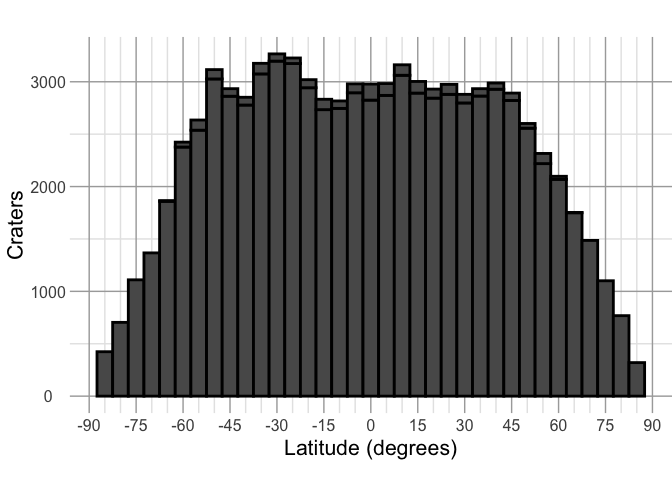<!-- -->

This is the normalized density over the whole lunar surface

``` r
df_craters_hist %>%
  group_by(LAT_ROUND) %>%
  summarize(
    NORM_LAT_ROUND = sum(COUNT_LAT_ROUND)/mean(CIRCUMFERENCE_LAT)
  ) %>%
  ggplot(aes(x = LAT_ROUND, y = NORM_LAT_ROUND)) +
  geom_col(
    aes(
      # fill = LAT_ROUND %>% as.character() %>% reorder(LAT_ROUND)
    ), 
    width = round_digits, 
    color = "black", 
    size = 1,
    show.legend = FALSE
  ) +
  scale_x_continuous(
    breaks = seq(-90,90,15),
    minor_breaks = seq(-90,90,15)
  ) +
  # scale_y_log10() +
  theme_common() +
  theme(
    panel.grid.major = element_line(color = "grey90"),
    # panel.grid.minor = element_line(color = "grey90"),
  ) +
  labs(
    x = "Latitude (degrees)",
    y = "Crater Density \n (craters/km)",
    # caption = "\n Lunar crater density distribution at different latitudes \n"
  )
```

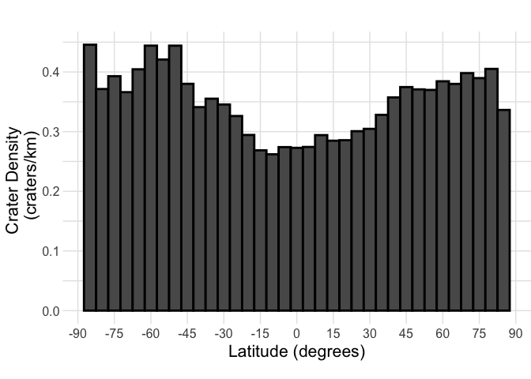<!-- -->

Normalized density for each biome, with bounds of the shapefile
indicated

``` r
df_craters_hist %>%
  mutate(
    NORM_LAT_ROUND_BIOME = COUNT_LAT_ROUND/CIRCUMFERENCE_BIOME
  ) %>%
  
  ggplot(aes(x = LAT_ROUND, y = NORM_LAT_ROUND_BIOME)) +
  geom_col(
    aes(
      # fill = LAT_ROUND %>% as.character() %>% reorder(LAT_ROUND)
    ), 
    width = round_digits, 
    color = "black", 
    size = 1,
    show.legend = FALSE
  ) +
  # geom_vline(aes(xintercept = 64.7, color = "Bounds of Maria Shapefile")) +
  # geom_vline(aes(xintercept = -66.5, color = "Bounds of Maria Shapefile")) +
  geom_vline(xintercept = 64.7) +
  geom_vline(xintercept = -66.5) +
  facet_wrap(vars(BIOME)) +
  scale_x_continuous(
    breaks = seq(-90,90,30),
    minor_breaks = seq(-90,90,15)
  ) +
  # scale_y_log10() +
  theme_common() +
  theme(
    # panel.grid.major = element_line(color = "darkgrey"),
    panel.grid.major = element_line(color = "grey90"),
    # panel.grid.minor = element_line(color = "grey90"),
  ) +
  labs(
    x = "Latitude (degrees)",
    y = "Crater Density By Biome \n (Craters/KM)"
  )
```

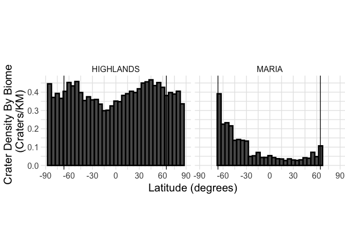<!-- -->
Mean and SD of the density over the whole lunar surface.

``` r
df_craters_hist %>%
  group_by(LAT_ROUND) %>%
  summarize(
    COUNT_LAT_ROUND = sum(COUNT_LAT_ROUND),
    CIRCUMFERENCE_LAT = mean(CIRCUMFERENCE_LAT),
    NORM_LAT_ROUND = COUNT_LAT_ROUND/CIRCUMFERENCE_LAT
  ) %>%
  summarize(
    mean = mean(NORM_LAT_ROUND),
    sd = sd(NORM_LAT_ROUND)
  )
```

    ## # A tibble: 1 × 2
    ##    mean     sd
    ##   <dbl>  <dbl>
    ## 1 0.350 0.0545

Mean and SD of the density for each biome

``` r
df_craters_hist %>%
  mutate(
    NORM_LAT_ROUND_BIOME = COUNT_LAT_ROUND/CIRCUMFERENCE_BIOME
  ) %>%
  group_by(BIOME) %>%
  summarize(
    mean = mean(NORM_LAT_ROUND_BIOME),
    sd = sd(NORM_LAT_ROUND_BIOME)
  )
```

    ## # A tibble: 2 × 3
    ##   BIOME       mean     sd
    ##   <chr>      <dbl>  <dbl>
    ## 1 HIGHLANDS 0.392  0.0455
    ## 2 MARIA     0.0925 0.0870

## More stuff I’m leaving in

Here is the crater map, but categorized by biome

``` r
df_craters %>%
  ggplot() +
  geom_point(
    aes(x = LON_ELLI_IMG, y = LAT_ELLI_IMG, color = MARIA), 
    size = 1,
    alpha = 0.2) +
  coord_fixed()
```

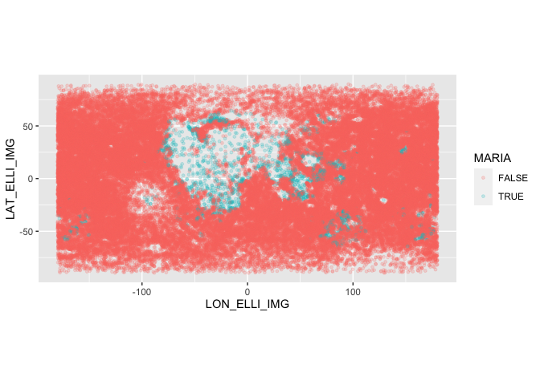<!-- -->

The original shapefile

``` r
# Showing the original shapefile
map %>%
  ggplot() +
  geom_sf(
    fill = "blue",
    color = "blue"
    )
```

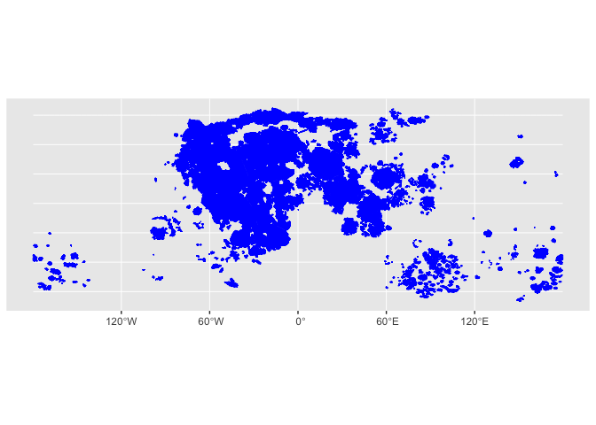<!-- -->

Portion of maria across different latitudes

``` r
df_craters_hist %>%
  filter(MARIA == FALSE) %>%
  ggplot(aes(x = LAT_ROUND, y = 1-PORTION_MARIA)) +
  geom_col(
    aes(
      # fill = LAT_ROUND %>% as.character() %>% reorder(LAT_ROUND)
    ), 
    width = round_digits, 
    color = "black", 
    size = 1,
    show.legend = FALSE
  ) +
  scale_x_continuous(
    breaks = seq(-90,90,15),
    minor_breaks = seq(-90,90,5)
  ) +
  # scale_y_log10() +
  theme_common() +
  theme(
    panel.grid.major = element_line(color = "darkgrey"),
    panel.grid.minor = element_line(color = "grey90"),
  ) +
  labs(
    x = "Latitude (degrees)",
    y = "Maria Portion per Latitude"
  )
```

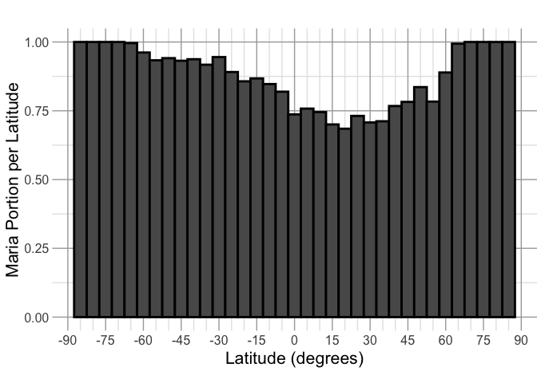<!-- -->

The density vs. the portion of maria, with points for each latitude.
This shows a relatively linear trend with more maria meaning lower
density

``` r
df_craters_hist %>%
  mutate(LAT_ROUND = abs(LAT_ROUND)) %>%
  group_by(LAT_ROUND) %>%
  summarize(
    COUNT_LAT_ROUND = sum(COUNT_LAT_ROUND),
    CIRCUMFERENCE_LAT = mean(CIRCUMFERENCE_LAT),
    PORTION_MARIA = mean(PORTION_MARIA)
  ) %>%
  mutate(
    COUNT_LAT_ROUND = ifelse(LAT_ROUND == 0, COUNT_LAT_ROUND * 2, COUNT_LAT_ROUND),
    NORM_LAT_ROUND = COUNT_LAT_ROUND/CIRCUMFERENCE_LAT
  ) %>%
  ggplot(aes(x = LAT_ROUND, y = NORM_LAT_ROUND)) +
  geom_point()
```

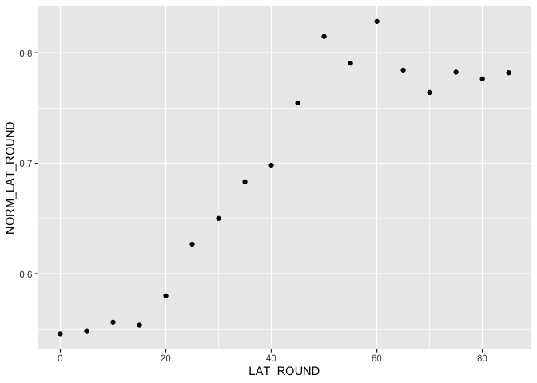<!-- -->

oh no there were so many links I used

<https://wms.lroc.asu.edu/lroc/view_rdr/SHAPEFILE_LROC_GLOBAL_MARE>

<https://gis.stackexchange.com/questions/133625/checking-if-points-fall-within-polygon-shapefile>

<https://r-spatial.org/r/2017/03/19/invalid.html>

<https://gis.stackexchange.com/questions/413584/fix-features-with-invalid-spherical-geometry-polygon-shape-file-for-s2-geometr>

<https://stackoverflow.com/questions/54734771/sf-write-lat-long-from-geometry-into-separate-column-and-keep-id-column>

<https://stackoverflow.com/questions/54734771/sf-write-lat-long-from-geometry-into-separate-column-and-keep-id-column>
